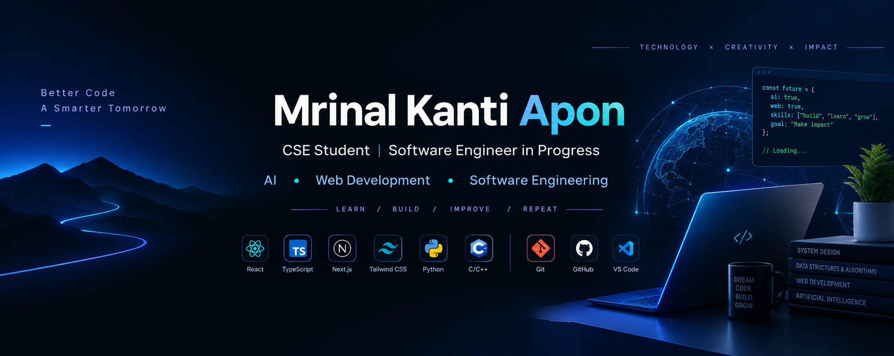

<div align="center">



# Hi, I'm Mrinal Kanti Apon 👋

### CSE Student | Software Engineer in Progress | AI & Web Development Enthusiast

📍 Dhaka, Bangladesh
📧 [mrinalkantiapon13@gmail.com](mailto:mrinalkantiapon13@gmail.com)

</div>

---

## 👨‍💻 About Me

I'm a **Computer Science and Engineering student** passionate about building practical software, modern web applications, and AI-powered solutions.

I'm currently strengthening my programming fundamentals, web development skills, and problem-solving ability while exploring the intersection of **AI and software engineering**.

I enjoy learning by building real projects, experimenting with new technologies, and continuously improving my development skills.

### 🚀 Currently

* 🌐 Exploring **modern web development**
* ⚛️ Building projects with **React, TypeScript & Tailwind CSS**
* ▲ Exploring **Next.js**
* 🤖 Exploring **AI-powered applications**
* 🧠 Practicing **problem solving & programming fundamentals**
* 🛠️ Building practical projects to improve my software engineering skills
* 📚 Studying **Computer Science & Engineering**

---

## 🛠️ Skills & Technologies

<div align="center">

### 💻 Programming


### 🌐 Web Development


### 🧰 Tools & Platforms


</div>

---

## 🚀 Featured Projects

### 🧩 Dev Stack Builder

A modern responsive web application for exploring web technologies and creating a personalized development stack.

**Tech Stack:** React • TypeScript • Vite • Tailwind CSS • DaisyUI

🔗 **Live Demo:** [ideal-development-stack.netlify.app](https://ideal-development-stack.netlify.app/)

🔗 **Repository:** [dev-stack-builder](https://github.com/mrinal-kanti-apon/dev-stack-builder)

---

### 🎨 My First Web Page — HTML & CSS

One of my first web development projects, built to practice HTML structure, CSS styling, layouts, images, and basic responsive design.

**Tech Stack:** HTML5 • CSS3

🔗 **Live Demo:** [my-01-first-web-page-using-only-HTML-CSS](https://mrinal-kanti-apon.github.io/my-01-first-web-page-using-only-HTML-CSS/)

🔗 **Repository:** [my-01-first-web-page-using-only-HTML-CSS](https://github.com/mrinal-kanti-apon/my-01-first-web-page-using-only-HTML-CSS)

---

## 📊 GitHub Statistics

<div align="center">


</div>

<br>

<div align="center">


</div>

---

## 🧠 Problem Solving & Learning

I'm continuously working on improving my:

* 🧩 Problem-solving ability
* 🧠 Logical thinking
* 💻 Programming fundamentals
* 📚 Data Structures & Algorithms
* 🚀 Software development skills

---

## 🎯 My Development Journey

```text
Computer Science & Engineering
              │
              ├── Programming Fundamentals
              │       ├── C
              │       ├── C++
              │       └── JavaScript / TypeScript
              │
              ├── Web Development
              │       ├── HTML & CSS
              │       ├── React
              │       ├── Tailwind CSS
              │       └── Next.js
              │
              ├── Software Engineering
              │       ├── Problem Solving
              │       ├── Data Structures & Algorithms
              │       └── Building Real Projects
              │
              └── AI & Intelligent Applications
                      ├── AI APIs
                      ├── AI-powered Applications
                      └── Future AI Systems
```

---

## 🌱 Learning Philosophy

> **Learn → Build → Debug → Improve → Repeat.**

I believe the best way to learn software development is to understand the fundamentals and continuously apply them through real projects.

---

## 📌 What I'm Working Toward

My long-term goal is to grow into a strong **Software Engineer with expertise in AI and modern web technologies**, capable of designing, building, and deploying useful real-world applications.

---

## 📫 Connect With Me

<div align="center">

<a href="mailto:mrinalkantiapon13@gmail.com">

</a>

<a href="https://github.com/mrinal-kanti-apon">

</a>

</div>

---

<div align="center">

### 👋 Thanks for visiting my profile!

⭐ Feel free to explore my repositories and follow my journey.

**CSE Student → Web Developer → Software Engineer → Expert in  AI/ML Engineer**

</div>
